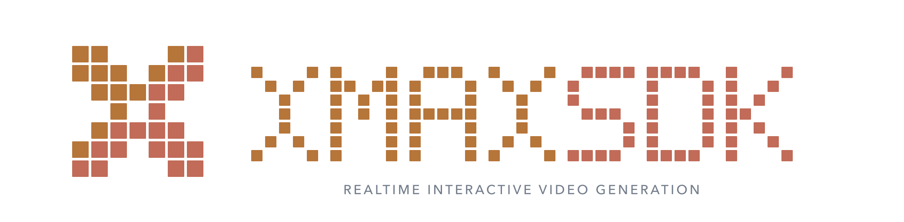
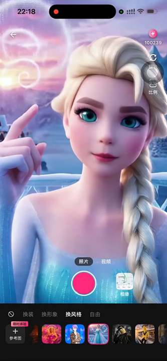
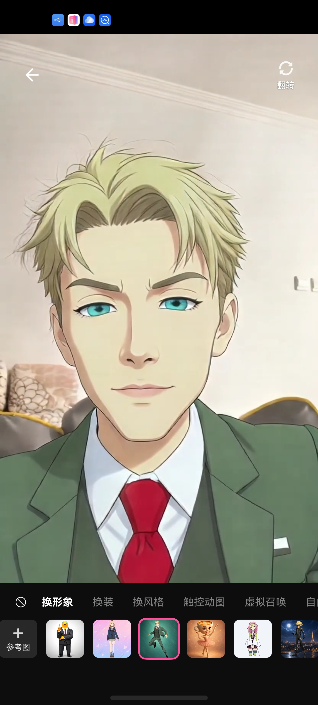

<p align="center">
  
</p>

<p align="center">
  <a href="https://flutter.dev/"></a>
  <a href="https://dart.dev/"></a>
  <a href="https://developer.apple.com/ios/"></a>
  <a href="https://developer.android.com/"></a>
  <a href="https://platform.xmaxai.com/"></a>
  <a href="./LICENSE"></a>
</p>

XmaxSDK is a Flutter SDK which provides access to Xmax's real-time, interactive
video generation models on iOS and Android. It enables low-latency,
cost-efficient, and high-fidelity video transformations, conditioned on reference
images, text prompts, and user interactions. With concise Dart APIs and Flutter
widgets, developers can integrate features such as real-time character swapping,
virtual try-on, or AI companions into their applications.

<p align="center"></p>

<br>

## What XmaxSDK does

XmaxSDK gives an end-to-end pipeline covering media capture, low-latency video
communication, frame-by-frame generation, and in-app rendering. The SDK streams
live camera input to our cloud AI engine and renders the generated video through
Flutter widgets, while supporting live prompt updates, reference images, camera
switching, and touch interaction. With the workflow abstracted into simple API
calls, integrating real-time video generation is seamless and intuitive.

<br>

## What you can build with XmaxSDK

<table>
  <tr>
    <th width="24%" align="left">Realtime Use Case</th>
    <th width="60%" align="left">Description</th>
    <th width="16%" align="center">Demo</th>
  </tr>
  <tr>
    <td rowspan="2" width="24%" valign="middle">
      <strong>Character Swapping</strong>
    </td>
    <td width="60%" valign="middle">
      Replace anyone in your live feed with a designated avatar in real time.
    </td>
    <td rowspan="2" width="16%" align="center" valign="middle">
      <a href="https://cdn.jsdelivr.net/gh/XingMai/XmaxSDK-Flutter@main/doc/videos/use-cases/character-swapping.mp4">
        
        <br>
        <sub>▶ Play demo</sub>
      </a>
    </td>
  </tr>
  <tr>
    <td width="60%" valign="middle">
      <strong>Prompt:</strong> <code>视频中角色替换成参考图中角色</code>
      <br><br>
      <strong>Reference image:</strong> Select a clear image of the desired character with a clean background.
    </td>
  </tr>
  <tr>
    <td rowspan="2" width="24%" valign="middle">
      <strong>Virtual Try-On</strong>
    </td>
    <td width="60%" valign="middle">
      Seamlessly change outfits, preserving exact body shape, natural motion, and
      an authentic fit.
    </td>
    <td rowspan="2" width="16%" align="center" valign="middle">
      <a href="https://cdn.jsdelivr.net/gh/XingMai/XmaxSDK-Flutter@main/doc/videos/use-cases/virtual-try-on.mp4">
        
        <br>
        <sub>▶ Play demo</sub>
      </a>
    </td>
  </tr>
  <tr>
    <td width="60%" valign="middle">
      <strong>Prompt:</strong> <code>视频中人物衣服替换成参考图中衣服</code>
      <br><br>
      <strong>Reference image:</strong> Select a clear image of the target outfit with a clean background.
    </td>
  </tr>
  <tr>
    <td rowspan="2" width="24%" valign="middle">
      <strong>Video Restyling</strong>
    </td>
    <td width="60%" valign="middle">
      Reimagine your world in any style with an immersive visual experience.
    </td>
    <td rowspan="2" width="16%" align="center" valign="middle">
      <a href="https://cdn.jsdelivr.net/gh/XingMai/XmaxSDK-Flutter@main/doc/videos/use-cases/video-restyling.mp4">
        
        <br>
        <sub>▶ Play demo</sub>
      </a>
    </td>
  </tr>
  <tr>
    <td width="60%" valign="middle">
      <strong>Prompt:</strong> <code>视频风格变为参考图指定的风格</code>
      <br><br>
      <strong>Reference image:</strong> Select an image that captures the artistic style you want to apply.
    </td>
  </tr>
  <tr>
    <td rowspan="2" width="24%" valign="middle">
      <strong>AI Companions</strong>
    </td>
    <td width="60%" valign="middle">
      Summon virtual characters into your live camera feed and interact with them
      through gestures.
    </td>
    <td rowspan="2" width="16%" align="center" valign="middle">
      <a href="https://cdn.jsdelivr.net/gh/XingMai/XmaxSDK-Flutter@main/doc/videos/use-cases/ai-companions.mp4">
        
        <br>
        <sub>▶ Play demo</sub>
      </a>
    </td>
  </tr>
  <tr>
    <td width="60%" valign="middle">
      <strong>Prompt:</strong> <code>指定角色在场景中互动</code>
      <br><br>
      <strong>Reference image:</strong> Select a clear image of the virtual character you want to summon with a clean background.
    </td>
  </tr>
</table>

<br>

## Why XmaxSDK?

<table>
  <thead>
    <tr>
      <th height="104" align="center" valign="middle">
        <br>Low latency
      </th>
      <th height="104" align="center" valign="middle">
        <br>Cost efficiency
      </th>
      <th height="104" align="center" valign="middle">
        <br>High fidelity
      </th>
    </tr>
  </thead>
  <tbody>
    <tr>
      <td>End-to-end latency is measured in , ensuring that updates to generation conditions and interaction controls are reflected instantly.</td>
      <td>Run on a , reducing inference costs by orders of magnitude versus datacenter GPUs like H100.</td>
      <td>Our models support real-time generation at up to , delivering production-ready, high-quality video output.</td>
    </tr>
  </tbody>
</table>

<br>

## Prerequisites

- Flutter 3.35 or later
- Dart 3.9 or later
- iOS 15.0 or later, or Android API 26 or later
- Java 17 for Android builds
- An Xmax API key

> [!WARNING]
> Never commit your Xmax API key to version control. Pass it securely at
> runtime or use short-lived temporary keys issued by the Xmax API. For step-by-step
> instructions, see [Authentication](https://platform.xmaxai.com/docs/authentication).

<br>

## Installation

XmaxSDK is published on [pub.dev](https://pub.dev/packages/xmax_sdk) and can also
be integrated from a Git revision or a local source checkout.

### pub.dev

Add XmaxSDK to your application's `pubspec.yaml`:

```yaml
dependencies:
  xmax_sdk: ^1.0.1
```

### Git

To use a release tag or commit directly from GitHub:

```yaml
dependencies:
  xmax_sdk:
    git:
      url: https://github.com/XingMai/XmaxSDK-Flutter.git
      ref: 1.0.1
```

### Local path

To use a local source checkout during development:

```yaml
dependencies:
  xmax_sdk:
    path: ../XmaxSDK
```

Install the dependencies:

```bash
flutter pub get
```

<br>

## Host Configuration

### iOS

Set the deployment target to iOS 15.0 or later and add the VolcEngine CocoaPods
spec source before the CocoaPods CDN source in `ios/Podfile`:

```ruby
source 'https://github.com/volcengine/volcengine-specs.git'
source 'https://cdn.cocoapods.org/'

platform :ios, '15.0'

target 'Runner' do
  use_frameworks!

  # Keep the Flutter pod installation generated by the Flutter template here.
end
```

Enable the camera permission handler in the existing `post_install` block:

```ruby
post_install do |installer|
  installer.pods_project.targets.each do |target|
    flutter_additional_ios_build_settings(target)
    target.build_configurations.each do |config|
      config.build_settings['GCC_PREPROCESSOR_DEFINITIONS'] ||= [
        '$(inherited)',
        'PERMISSION_CAMERA=1',
      ]
    end
  end
end
```

Add a camera usage description to `ios/Runner/Info.plist`:

```xml
<key>NSCameraUsageDescription</key>
<string>This app uses the camera for real-time video input.</string>
```

Customize this message to match your application's user experience. XmaxSDK
automatically prompts for camera access when creating the video stream and throws
an `XmaxError` if permission is denied or unavailable.

See the complete [`example/ios/Podfile`](example/ios/Podfile) for a working setup.

### Android

Set the application's minimum SDK to 26 and compile with Java 17 in
`android/app/build.gradle.kts`:

```kotlin
android {
    compileOptions {
        sourceCompatibility = JavaVersion.VERSION_17
        targetCompatibility = JavaVersion.VERSION_17
    }

    defaultConfig {
        minSdk = 26
    }
}
```

Add the VolcEngine repository to the project dependency repositories in
`android/build.gradle.kts`:

```kotlin
allprojects {
    repositories {
        maven(url = "https://artifact.bytedance.com/repository/Volcengine/")
        google()
        mavenCentral()
    }
}
```

Also make it available while Flutter plugins are resolved in
`android/settings.gradle.kts`:

```kotlin
pluginManagement {
    repositories {
        maven(url = "https://artifact.bytedance.com/repository/Volcengine/")
        google()
        mavenCentral()
        gradlePluginPortal()
    }
}
```

Enable AndroidX and Jetifier in `android/gradle.properties`:

```properties
android.useAndroidX=true
android.enableJetifier=true
```

Declare the required permissions in `android/app/src/main/AndroidManifest.xml`:

```xml
<uses-permission android:name="android.permission.INTERNET" />
<uses-permission android:name="android.permission.CAMERA" />
<uses-permission android:name="android.permission.MODIFY_AUDIO_SETTINGS" />
```

The camera-only SDK does not capture microphone audio, share the screen, use legacy
external storage, read phone state, or draw overlays. The full VolcEngine RTC AAR
declares permissions and components for those capabilities, so remove them during
manifest merging. Copy the cleanup declarations from the example's
[`AndroidManifest.xml`](example/android/app/src/main/AndroidManifest.xml), and see
[`build.gradle.kts`](example/android/app/build.gradle.kts) for the AndroidX vector
dependency constraints used by the example.

The full VolcEngine RTC AAR also contains optional native extensions that link
against the shared NDK C++ runtime without bundling it. Ensure the host APK includes
`libc++_shared.so` for every enabled ABI. The example's
[`build.gradle.kts`](example/android/app/build.gradle.kts) includes a cross-platform
`prepareRtcCppRuntime` task that copies the matching runtime from the pinned NDK;
apply the same host configuration when integrating XmaxSDK into another Android app.

Release builds with R8 must also suppress warnings for optional device and serializer
APIs referenced by VolcEngine RTC and Tencent COS. Add the following rules to the
host application's Release ProGuard configuration:

```proguard
-dontwarn com.hihonor.android.magicx.media.audio.interfaces.**
-dontwarn java.awt.**
-dontwarn javax.money.**
-dontwarn com.google.common.collect.ArrayListMultimap
-dontwarn com.google.common.collect.Multimap
-dontwarn org.javamoney.moneta.**
-dontwarn org.joda.time.**
-dontwarn springfox.documentation.spring.web.json.Json
```

The same configuration is available in the example's
[`proguard-rules.pro`](example/android/app/proguard-rules.pro).

<br>

## Quick Start

### Generate and display video

The following Flutter widget creates a camera stream, starts real-time generation,
and binds the local and generated video tracks. Keep the manager and streams in
widget state for the lifetime of the screen.

```dart
import 'dart:async';

import 'package:flutter/material.dart';
import 'package:xmax_sdk/xmax_sdk.dart';

class RealtimePage extends StatefulWidget {
  const RealtimePage({super.key});

  @override
  State<RealtimePage> createState() => _RealtimePageState();
}

class _RealtimePageState extends State<RealtimePage> {
  late final XmaxRealtimeManaging _realtime;
  RealtimeMediaStream? _localStream;
  RealtimeMediaStream? _remoteStream;

  @override
  void initState() {
    super.initState();

    final client = XmaxClient(
      configuration: XmaxConfiguration(apiKey: 'YOUR_XMAX_API_KEY'),
    );
    _realtime = client.createRealtimeManager(
      options: const RealtimeConfiguration(model: RealtimeModel.x2_0),
    );
    unawaited(_start());
  }

  Future<void> _start() async {
    final localStream = await _realtime.createLocalCameraStream(
      videoFormat: const RealtimeVideoFormat(
        width: 704,
        height: 1280,
        fps: 24,
      ),
      position: CameraPosition.front,
    );
    if (!mounted) return;
    setState(() => _localStream = localStream);

    final remoteStream = await _realtime.startGeneration(
      localStream: localStream,
      context: RealtimeContext(
        prompt: '视频中角色替换成参考图中角色',
        referencePath:
            'https://platform.xmaxai.com/images/source/charx/chatx_image1.jpg',
      ),
    );
    if (!mounted) return;
    setState(() => _remoteStream = remoteStream);
  }

  @override
  void dispose() {
    unawaited(_realtime.close());
    super.dispose();
  }

  @override
  Widget build(BuildContext context) {
    final localStream = _localStream;
    if (localStream == null) {
      return const Center(child: CircularProgressIndicator());
    }

    return XmaxRealtimeVideoView(
      localTrack: localStream.videoTrack,
      remoteTrack: _remoteStream?.videoTrack,
      videoContentMode: VideoContentMode.fill,
    );
  }
}
```

The widget keeps the local camera preview underneath the generated video, enables
touch interaction by default, and returns to the local preview after
`stopGeneration()` or `disconnect()`.

To update an active generation task, submit a new context without another local
stream:

```dart
await realtime.startGeneration(
  context: RealtimeContext(
    prompt: '视频中人物衣服替换成参考图中衣服',
    referencePath: anotherReferenceImageURL,
  ),
);
```

Switch between the front and rear cameras without rebuilding the manager:

```dart
final switchedStream = await realtime.switchCamera();
```

<br>

### Listen for events

After creating `realtime`, register the listeners you need before creating the
input stream or starting generation.

| Listener | Purpose |
| --- | --- |
| `setStateListener` | Observe pipeline states during real-time generation. |
| `setErrorListener` | Handle fatal errors that prevent the realtime workflow from continuing. |
| `setCameraPreviewReadyListener` | Be notified when the initial local camera frame is ready for preview rendering. |
| `setNetworkQualityListener` | Monitor uplink and downlink network quality. |
| `setPerformanceAlarmListener` | Detect device performance limitations or recovery, with a suggested video format when available. |

For example, monitor state changes and errors:

```dart
await realtime.setStateListener((state) {
  debugPrint('State: ${state.connectionState.value}');
});

await realtime.setErrorListener((error) {
  debugPrint('Error: ${error.code.value} ${error.message}');
});
```

<br>

### Resource Cleanup

- **`stopGeneration()` — Stop the Current Task**

  Stops the active generation task while keeping the remote session and local
  camera preview available:

  ```dart
  await realtime.stopGeneration();
  ```

- **`disconnect()` — Stop Remote Generation**

  Ends the remote session and cancels billing while keeping the local camera stream
  and preview active. A new session can later use the same local stream:

  ```dart
  await realtime.disconnect();
  ```

- **`close()` — Full Teardown & Release**

  Ends the remote session, stops local media capture, and releases all RTC resources.
  Use this when leaving the generation screen:

  ```dart
  await realtime.close();
  ```

> **Note:** `disconnect()` and `close()` are alternatives, not sequential steps.
> When exiting a screen, call `close()` directly—there is no need to call
> `disconnect()` first.

<br>

### Touch interaction

During an active generation task, `XmaxRealtimeVideoView` captures multi-touch
trajectories over the generated video, converts them into video coordinates, and
submits them to the active task. Trajectory interaction and the default visual
effect are enabled by default.

Disable interaction when touch input belongs to the surrounding interface:

```dart
XmaxRealtimeVideoView(
  localTrack: localStream.videoTrack,
  remoteTrack: remoteStream?.videoTrack,
  isInteractionEnabled: false,
)
```

Provide a `TrajectoryEffectRendering` implementation to customize the local touch
effect. A runnable implementation is available in
[`xlab_trajectory_renderer.dart`](example/lib/features/realtime/xlab_trajectory_renderer.dart).

<br>

### Reference image upload

`RealtimeContext.referencePath` accepts a supported remote reference-image URL.
Upload an on-device image through the storage manager before using it as a
generation condition:

```dart
final storage = client.createStorageManager();

final uploaded = await storage.uploadImage(
  at: Uri.file('/path/to/reference.jpg'),
  contentType: 'image/jpeg',
);

final referenceImageURL = uploaded.url.toString();
```

Use `uploadImageWithSafetyCheck()` when the image must pass the Xmax safety check.
The storage manager obtains temporary credentials from Xmax; Tencent Cloud
credentials are not embedded in the host application.

<br>

### Logging

SDK logging is disabled by default. Enable business logs, performance logs, or both
when creating the client:

```dart
final client = XmaxClient(
  configuration: XmaxConfiguration(
    apiKey: 'YOUR_XMAX_API_KEY',
    loggerOptions: XmaxLoggerOption.all,
  ),
);
```

Logging configuration is process-wide and shared by all `XmaxClient` instances.

<br>

## Example Project

A complete example application for both iOS and Android is available in
[`example`](https://github.com/XingMai/XmaxSDK-Flutter/tree/main/example). It
demonstrates real-time generation using live camera feeds.

<p align="center"></p>

<br>

## Dependencies

- <ins><strong>VolcEngine RTC SDK</strong></ins> enables low-latency, real-time audio and video communication.
- <ins><strong>Tencent Cloud COS SDK</strong></ins> handles media upload and download via object storage.

<br>

## Contact us

For bug reports and feature requests, please open a
[GitHub Issue](https://github.com/XingMai/XmaxSDK-Flutter/issues). For integration
assistance and technical support, contact us at [sdk@xmax.ai](mailto:sdk@xmax.ai).

<br>

## License

XmaxSDK is available under the terms of the [MIT License](LICENSE).
