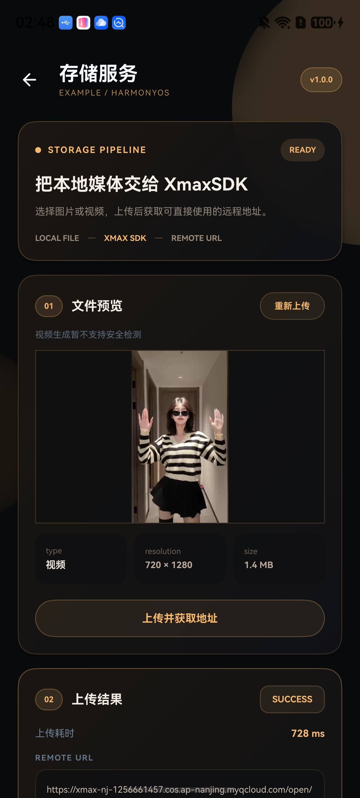

<h1 align="center">XmaxSDK for Flutter</h1>

<p align="center">
  <a href="https://flutter.dev/"></a>
  <a href="https://dart.dev/"></a>
  <a href="https://developer.apple.com/ios/"></a>
  <a href="https://developer.android.com/"></a>
  <a href="https://platform.xmaxai.com/"></a>
  <a href="./LICENSE"></a>
</p>

A Flutter SDK which provides access to the real-time interactive video generation
models from Xmax AI. It enables low-latency, high-fidelity video transformations
using live video streams, reference images, and user interactions.
With just a few lines of code, developers can integrate features such as
real-time character swap, virtual try-on, mixed-reality companions,
and interactive image animation directly into their apps.

<p align="center"></p>

<br>

## Features

- Real-time video generation from live camera streams, guided by prompts,
  reference images, and user interactions
- In-application rendering of the local camera input and generated output
- Multi-touch trajectory input for controlling subject movement in generated
  video streams
- Image and video transfer through Xmax-managed object storage
- Asynchronous APIs based on Dart Futures
- Flutter widget integration for iOS and Android

## Requirements

- Flutter 3.35 or later
- Dart 3.9 or later
- iOS 15.0 or later, or Android API 26 or later
- Java 17 for Android builds
- An Xmax API key

> [!WARNING]
> Do not commit an Xmax API key to version control. Supply credentials securely at
> runtime, or use a temporary key issued by the Xmax API. See
> [Authentication](https://platform.xmaxai.com/docs/authentication) for details.

## Installation

XmaxSDK is currently distributed as a Git package. Add it to the application's
`pubspec.yaml`:

```yaml
dependencies:
  xmax_sdk:
    git:
      url: https://github.com/XingMai/XmaxSDK-Flutter.git
```

For reproducible builds, pin the dependency to a release tag or commit with the
Git dependency's `ref` field. During local development, a path dependency can be
used instead:

```yaml
dependencies:
  xmax_sdk:
    path: ../XmaxSDK
```

Install the dependencies:

```bash
flutter pub get
```

Then complete the host-platform configuration below.

## Platform Configuration

### iOS

Set the deployment target to iOS 15.0 or later and add the VolcEngine CocoaPods
spec source before the CocoaPods CDN source in `ios/Podfile`:

```ruby
source 'https://github.com/volcengine/volcengine-specs.git'
source 'https://cdn.cocoapods.org/'

platform :ios, '15.0'

target 'Runner' do
  use_frameworks!

  # Keep the Flutter pod installation generated by the Flutter template here.
end
```

Enable the camera permission handler in the existing `post_install` block:

```ruby
post_install do |installer|
  installer.pods_project.targets.each do |target|
    flutter_additional_ios_build_settings(target)
    target.build_configurations.each do |config|
      config.build_settings['GCC_PREPROCESSOR_DEFINITIONS'] ||= [
        '$(inherited)',
        'PERMISSION_CAMERA=1',
      ]
    end
  end
end
```

Provide a camera usage description in `ios/Runner/Info.plist`:

```xml
<key>NSCameraUsageDescription</key>
<string>This app uses the camera for real-time video input.</string>
```

Replace the description with text appropriate for the application. XmaxSDK checks
and requests camera permission when a local camera stream is created.

See the complete [`example/ios/Podfile`](example/ios/Podfile) for a working setup.

### Android

Set the application's minimum SDK to 26 and compile with Java 17 in
`android/app/build.gradle.kts`:

```kotlin
android {
    compileOptions {
        sourceCompatibility = JavaVersion.VERSION_17
        targetCompatibility = JavaVersion.VERSION_17
    }

    defaultConfig {
        minSdk = 26
    }
}
```

Add the VolcEngine repository to the project dependency repositories in
`android/build.gradle.kts`:

```kotlin
allprojects {
    repositories {
        maven(url = "https://artifact.bytedance.com/repository/Volcengine/")
        google()
        mavenCentral()
    }
}
```

Also make it available while Flutter plugins are resolved in
`android/settings.gradle.kts`:

```kotlin
pluginManagement {
    repositories {
        maven(url = "https://artifact.bytedance.com/repository/Volcengine/")
        google()
        mavenCentral()
        gradlePluginPortal()
    }
}
```

Enable AndroidX and Jetifier in `android/gradle.properties`:

```properties
android.useAndroidX=true
android.enableJetifier=true
```

Declare the required permissions in `android/app/src/main/AndroidManifest.xml`:

```xml
<uses-permission android:name="android.permission.INTERNET" />
<uses-permission android:name="android.permission.CAMERA" />
<uses-permission android:name="android.permission.MODIFY_AUDIO_SETTINGS" />
```

The camera-only SDK does not capture microphone audio, share the screen, use legacy
external storage, read phone state, or draw overlays. The full VolcEngine RTC AAR
declares permissions and components for those capabilities, so remove them during
manifest merging. Copy the cleanup declarations from the example's
[`AndroidManifest.xml`](example/android/app/src/main/AndroidManifest.xml), and see
[`build.gradle.kts`](example/android/app/build.gradle.kts) for the AndroidX vector
dependency constraints used by the example.

The full VolcEngine RTC AAR also contains optional native extensions that link
against the shared NDK C++ runtime without bundling it. Ensure the host APK includes
`libc++_shared.so` for every enabled ABI. The example's
[`build.gradle.kts`](example/android/app/build.gradle.kts) includes a cross-platform
`prepareRtcCppRuntime` task that copies the matching runtime from the pinned NDK;
apply the same host configuration when integrating XmaxSDK into another Android app.

## Getting Started

### Create a client

```dart
import 'package:xmax_sdk/XmaxSDK.dart';

final client = XmaxClient(
  configuration: XmaxConfiguration(apiKey: 'YOUR_API_KEY'),
);

final realtime = client.createRealtimeManager(
  options: const RealtimeConfiguration(model: RealtimeModel.x2_0),
);
```

Realtime state and errors can be observed on the manager:

```dart
await realtime.setStateListener((state) {
  print(
    'Xmax realtime state: ${state.connectionState.value}, '
    'session: ${state.sessionID ?? '-'}, task: ${state.taskID ?? '-'}',
  );
});

await realtime.setErrorListener((error) {
  print('Xmax realtime error: ${error.code.value} ${error.message}');
});
```

### Create a camera stream

Create a local stream after camera permission can be requested:

```dart
final localStream = await realtime.createLocalCameraStream(
  videoFormat: const RealtimeVideoFormat(
    width: 832,
    height: 1472,
    fps: 24,
  ),
  position: CameraPosition.front,
);
```

Only one local camera stream may be active at a time. Switch between the front and
rear cameras without rebuilding the manager:

```dart
final switchedStream = await realtime.switchCamera();
```

### Start generation

Construct a `RealtimeContext` with a prompt and, when applicable, a remote
reference-image URL:

```dart
final remoteStream = await realtime.startGeneration(
  localStream: localStream,
  context: RealtimeContext(
    prompt: 'Replace the person with the character in the reference image',
    referencePath: referenceImageURL,
  ),
);
```

For the standard full-screen realtime experience, keep both tracks in the
recommended `XmaxRealtimeVideoView`:

```dart
XmaxRealtimeVideoView(
  localTrack: localStream.videoTrack,
  remoteTrack: remoteStream?.videoTrack,
  videoContentMode: VideoContentMode.fill,
)
```

It retains the local preview underneath the generated video, fades the remote
track in when its RTC binding is ready, and automatically returns to the local
preview after `stopGeneration()` or `disconnect()`. This avoids black frames
during native video-view handoff.

Use separate `XmaxVideoView` widgets only when the application needs custom
composition such as picture-in-picture:

```dart
Stack(
  children: [
    XmaxVideoView(track: localStream.videoTrack),
    Positioned(
      right: 16,
      top: 16,
      width: 120,
      height: 180,
      child: XmaxVideoView(track: remoteStream?.videoTrack),
    ),
  ],
)
```

To update an active generation task, submit a new context without another local
stream:

```dart
await realtime.startGeneration(
  context: RealtimeContext(
    prompt: 'Replace the outfit with the outfit in the reference image',
    referencePath: anotherReferenceImageURL,
  ),
);
```

### Stop and release resources

```dart
await realtime.stopGeneration();
await realtime.disconnect();
await realtime.close();
```

`stopGeneration()` terminates the active generation task while retaining the
remote connection and local preview. `disconnect()` closes the remote session while
preserving the local preview. `close()` releases local media and RTC resources and
should be called when the realtime workflow is no longer required, including when
the host page is disposed or the application enters the background.

## Touch Interaction

During an active generation task, `XmaxRealtimeVideoView` captures multi-touch
trajectories over its visible generated video, converts them into video
coordinates, and submits them to the active task. Trajectory interaction and the
default visual effect are enabled by default.

Disable interaction when touch input belongs to the surrounding interface:

```dart
XmaxRealtimeVideoView(
  localTrack: localStream.videoTrack,
  remoteTrack: remoteStream?.videoTrack,
  isInteractionEnabled: false,
)
```

Provide a `TrajectoryEffectRendering` implementation to customize the local touch
effect:

```dart
XmaxRealtimeVideoView(
  localTrack: localStream.videoTrack,
  remoteTrack: remoteStream?.videoTrack,
  trajectoryRenderer: customTrajectoryRenderer,
)
```

The runnable custom implementation is in
[`example/lib/features/realtime/xlab_trajectory_renderer.dart`](example/lib/features/realtime/xlab_trajectory_renderer.dart).

## Reference Image Upload

`RealtimeContext.referencePath` accepts a supported remote reference-image URL.
An on-device image can first be uploaded through the storage manager; it remains
a generation condition and is not used as the local RTC input:

```dart
final storage = client.createStorageManager();

final uploaded = await storage.uploadImage(
  at: Uri.file('/path/to/reference.jpg'),
  contentType: 'image/jpeg',
);

final referenceImageURL = uploaded.url.toString();
```

Use `uploadImageWithSafetyCheck()` when the image must pass the Xmax safety check.
The storage manager obtains temporary credentials from Xmax; Tencent Cloud
credentials are not embedded in the host application.

## Logging

SDK logging is disabled by default. Enable business logs, performance logs, or both
when creating the client:

```dart
final client = XmaxClient(
  configuration: XmaxConfiguration(
    apiKey: 'YOUR_API_KEY',
    loggerOptions: XmaxLoggerOption.all,
  ),
);
```

Logging configuration is process-wide and shared by all `XmaxClient` instances.

## XLab Example App

XLab is the runnable iOS and Android reference application in [`example`](example).
It demonstrates camera generation, camera switching, live prompt updates, default
and custom trajectory rendering, storage upload, image safety checks, state and
quality monitoring, and lifecycle-aware resource cleanup.

<p align="center"></p>

Run it on a physical device:

```bash
cd example
flutter pub get
flutter run
```

## Dependencies

- VolcEngine RTC Flutter SDK provides real-time audio and video communication.
- Tencent Cloud COS Flutter SDK provides image and video transfer through object
  storage.

## Feedback

For bug reports and feature requests, use
[GitHub Issues](https://github.com/XingMai/XmaxSDK-Flutter/issues). For integration
questions and technical support, contact [sdk@xmax.ai](mailto:sdk@xmax.ai).

## License

XmaxSDK is available under the terms of the [MIT License](LICENSE).
